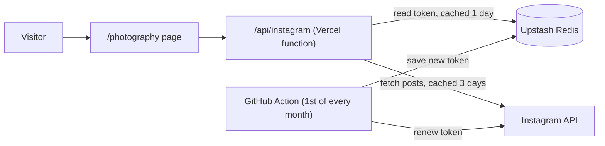

# Ashish Kumar Panda - Coder | Artist | Traveller

Adjusting focal lengths globally, tuning AI hyperparameters locally. A seasoned developer and MSCS student with a photographer's eye.


## Tech stack

| Layer | Technology |
|---|---|
| Framework | Next.js 15 (App Router) with React 19 and TypeScript |
| Styling | Tailwind CSS with shadcn/ui components (Radix UI primitives) |
| Animation | Framer Motion, plus a 192-frame image sequence for the parallax hero |
| Icons | Lucide |
| Hosting | Vercel |
| Photo feed | Instagram API with Instagram Login (Meta) |
| Token store | Upstash Redis (REST API) |
| Scheduled jobs | GitHub Actions |

## Pages

| Route | What it shows |
|---|---|
| `/` | Hero, about, experience, featured projects, and links to the pages below |
| `/photography` | A live gallery of posts from [@ash.galleryyy](https://instagram.com/ash.galleryyy) |
| `/extracurriculars` | Achievements, arts and community work |
| `/courses` | Graduate and undergraduate coursework |

Most site content (experience, projects, publications, courses, extracurriculars) lives in [`src/lib/config.ts`](src/lib/config.ts).

## How the photography gallery works



- **No login for visitors.** The server fetches posts with the site owner's access token; visitors only receive image links.
- **Caching.** Posts are refetched at most every 3 days, because Instagram's image links expire after about 5 days. New uploads appear within 3 days.
- **What's shown.** Photos and multi-photo posts (cover image only). Videos and reels are skipped, and the 6 oldest posts are hidden.
- **Token renewal.** Instagram tokens last 60 days. [`refresh-instagram-token.yml`](.github/workflows/refresh-instagram-token.yml) renews the token monthly and saves it to Redis, where the site reads it. If Redis isn't configured, the site falls back to the `INSTAGRAM_ACCESS_TOKEN` environment variable.

## Configuration

Set these in Vercel (Settings → Environment Variables) and as GitHub Actions secrets. For local development, put them in `.env`, which is not committed.

| Variable | Purpose |
|---|---|
| `INSTAGRAM_ACCESS_TOKEN` | Initial long-lived Instagram token (from the Meta app's Instagram API setup) |
| `UPSTASH_REDIS_REST_URL` | Upstash Redis REST endpoint |
| `UPSTASH_REDIS_REST_TOKEN` | Upstash Redis REST token |

## Running locally

```bash
npm install
npm run dev   # http://localhost:9002
```
